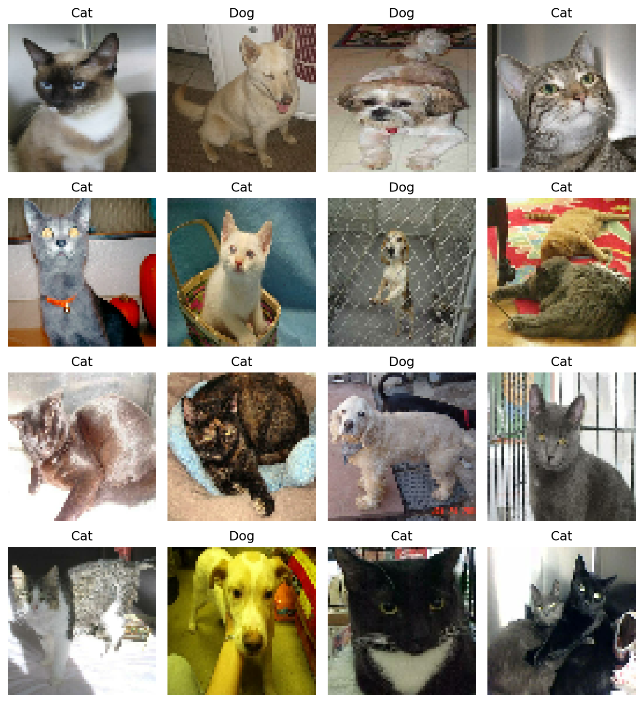
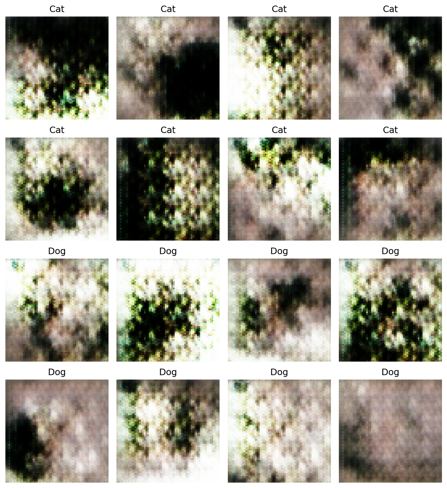

# Conditional GAN for Class-Controlled Cat and Dog Image Generation

This repository contains a complete Conditional Generative Adversarial Network
(cGAN) implementation for generating cat or dog images conditioned on class
labels. The project was built as the Module 37 graded mini project for the
Advanced Certificate Programme in Applied Artificial Intelligence and Machine
Learning.

The final submission artifact is included as:

[Module 37 - Graded Mini Project_Manoj_Bhardwaj.pdf](<Module 37 - Graded Mini Project_Manoj_Bhardwaj.pdf>)

## Problem Solved

Standard GANs generate images from random noise, but they do not provide direct
control over the category of the generated output. This project solves that
control problem by conditioning both the generator and discriminator on class
labels.

The model learns to generate 64x64 RGB images using this assignment label
convention:

| Label | Class |
|---:|---|
| 0 | Cat |
| 1 | Dog |

By injecting label information into both adversarial networks, the generator is
guided to produce class-specific outputs and the discriminator learns whether an
image is both realistic and consistent with the supplied label.

## Key Outcomes

- Loaded the Cats vs Dogs dataset directly through TensorFlow Datasets.
- Verified that TFDS maps `0 = cat` and `1 = dog`.
- Preprocessed images to `64x64x3` and normalized pixels to `[-1, 1]`.
- Built a conditional generator with noise plus label embedding.
- Built a conditional discriminator with image plus spatial label conditioning.
- Trained the adversarial model for the required 10 epochs.
- Saved epoch-wise generated image grids and a final PDF report.

## Tech Stack

| Area | Technology |
|---|---|
| Programming language | Python 3.11 |
| Deep learning framework | TensorFlow / Keras |
| Dataset source | TensorFlow Datasets, `cats_vs_dogs` |
| Numerical computing | NumPy |
| Visualization | Matplotlib |
| Model persistence | Keras `.keras` format |
| Report generation | ReportLab |
| Version control | Git and GitHub |

## Model Architecture

### Generator

The generator receives two inputs:

- A random latent vector of size `100`
- A class label, where `0 = Cat` and `1 = Dog`

The label is embedded and concatenated with the noise vector. The combined
representation is projected into a feature map and progressively upsampled with
`Conv2DTranspose` layers until it reaches a `64x64x3` RGB output. The final
activation is `tanh`, matching the `[-1, 1]` preprocessing range.

### Discriminator

The discriminator also receives two inputs:

- A real or generated image
- The corresponding class label

The label is embedded into a spatial `64x64x1` conditioning map and concatenated
with the RGB image. The combined tensor is passed through `Conv2D` layers and a
final dense layer to produce a real/fake logit.

### Training

Training uses:

- Binary cross-entropy with logits
- Separate Adam optimizers for generator and discriminator
- Learning rate `2e-4`
- `beta_1 = 0.5`
- Optimized `@tf.function` training step
- Alternating generator and discriminator gradient updates

## Results

Real preprocessed samples from the dataset:



Latest generated class-conditioned grid after 10 epochs:



The 10-epoch output shows early-stage GAN learning: the generated images contain
coarse animal-like textures and class-conditioned grids, but they are not yet
photorealistic. This is expected for a compact CPU-trained academic cGAN run.
Longer training, stronger model capacity, augmentation, and loss tuning would
improve visual fidelity.

Final recorded training losses:

| Epoch | Generator loss | Discriminator loss |
|---:|---:|---:|
| 1 | 2.1765 | 0.9041 |
| 2 | 1.3309 | 0.9905 |
| 3 | 1.5102 | 0.9294 |
| 4 | 1.3997 | 0.9012 |
| 5 | 1.5541 | 0.8660 |
| 6 | 1.7325 | 0.8094 |
| 7 | 1.8139 | 0.7293 |
| 8 | 1.9490 | 0.6879 |
| 9 | 2.1186 | 0.6753 |
| 10 | 2.5058 | 0.5724 |

## Repository Structure

```text
.
+-- src/
|   +-- cgan_cats_vs_dogs.py
+-- notebooks/
|   +-- Module_37_Graded_Mini_Project_Manoj_Bhardwaj.ipynb
+-- scripts/
|   +-- build_submission_artifacts.py
+-- outputs/
|   +-- samples/
|       +-- real_preprocessed_samples.png
|       +-- epoch_000_untrained.png
|       +-- epoch_001.png ... epoch_010.png
+-- requirements.txt
+-- cGAN.docx
+-- IITM_Pravartak_Week 37_Graded Mini Project.pdf
+-- Week 37_Task to be performed.pdf
+-- Module 37 - Graded Mini Project_Manoj_Bhardwaj.pdf
```

Large local runtime artifacts are intentionally excluded from Git:

- `.venv/`
- `.tfds/`
- `outputs/models/`
- `outputs/training_logs/`

## Setup

Use Python 3.11 for best compatibility with TensorFlow on Windows.

```powershell
py -3.11 -m venv .venv
.\.venv\Scripts\Activate.ps1
python -m pip install --upgrade pip
pip install -r requirements.txt
```

If your Windows/Python SSL certificates block package installation, add trusted
hosts for that install command:

```powershell
pip install --trusted-host pypi.org --trusted-host files.pythonhosted.org -r requirements.txt
```

## Run The Project

First validate the model wiring without downloading the dataset:

```powershell
python src\cgan_cats_vs_dogs.py --architecture-check
```

Run a one-batch dataset smoke test:

```powershell
python src\cgan_cats_vs_dogs.py --smoke-test --batch-size 8 --data-dir .tfds
```

If TFDS download fails with a certificate verification error, use:

```powershell
python src\cgan_cats_vs_dogs.py --smoke-test --batch-size 8 --data-dir .tfds --disable-download-ssl-verification
```

Run the full required 10-epoch training:

```powershell
python src\cgan_cats_vs_dogs.py --epochs 10 --batch-size 128 --data-dir .tfds --disable-download-ssl-verification
```

Rebuild the notebook and final PDF report after training:

```powershell
python scripts\build_submission_artifacts.py
```

## Windows Compatibility Notes

The code includes a targeted compatibility patch for a TensorFlow Datasets
`cats_vs_dogs` ZIP path issue seen on Windows. The patch preserves TFDS as the
dataset loader while keeping archive member paths in ZIP-compatible forward
slash format.

The `--disable-download-ssl-verification` flag is only for the TFDS dataset
download step and should be used only when local certificate configuration
blocks the Microsoft dataset download.

## Project Artifacts

- Final PDF report: [Module 37 - Graded Mini Project_Manoj_Bhardwaj.pdf](<Module 37 - Graded Mini Project_Manoj_Bhardwaj.pdf>)
- Notebook artifact: [Module_37_Graded_Mini_Project_Manoj_Bhardwaj.ipynb](notebooks/Module_37_Graded_Mini_Project_Manoj_Bhardwaj.ipynb)
- Main training script: [src/cgan_cats_vs_dogs.py](src/cgan_cats_vs_dogs.py)
- Latest generated image grid: [outputs/samples/epoch_010.png](outputs/samples/epoch_010.png)

## Rubric Alignment

This implementation directly covers the grading criteria:

- Dataset loading with TensorFlow Datasets
- Label verification and correct class mapping
- Image resizing, normalization, batching, shuffling, and prefetching
- Conditional generator with label embeddings
- Conditional discriminator with image-label conditioning
- Binary cross-entropy losses
- Separate Adam optimizers
- `@tf.function` optimized training step
- Epoch-wise progress reporting
- Label-conditioned output visualization
- Final result interpretation in the PDF report
